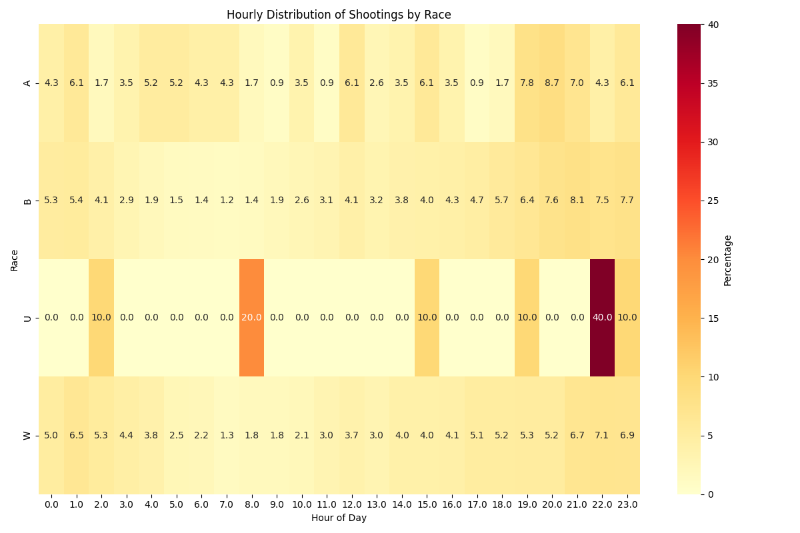

# Philadelphia Crime - Analysis of shooting crisis

This is a note for the analysis of shooting crisis data and the full crime report data.

## Notes

Found no direct overlaps between shooting and crime (based on objectid)
- There are some gun related incidents like *Robbery Firearm* or *Aggravated Assault Firearm*
- But is not in the shooting victims dataset

## Some visualization

Just curious about the hourly percentage of cirme occurence.
- shootings are by race
- crimes are by crime type

## Reference

[Phil Shooting victims](https://opendataphilly.org/datasets/shooting-victims/) and its [API documentation](https://cityofphiladelphia.github.io/carto-api-explorer/#shootings)

[Phil Crime incidents](https://opendataphilly.org/datasets/crime-incidents/) and its [API documentation](https://cityofphiladelphia.github.io/carto-api-explorer/#incidents_part1_part2) (full dataset)

[Phil Census Block](https://opendataphilly.org/datasets/census-blocks/)

